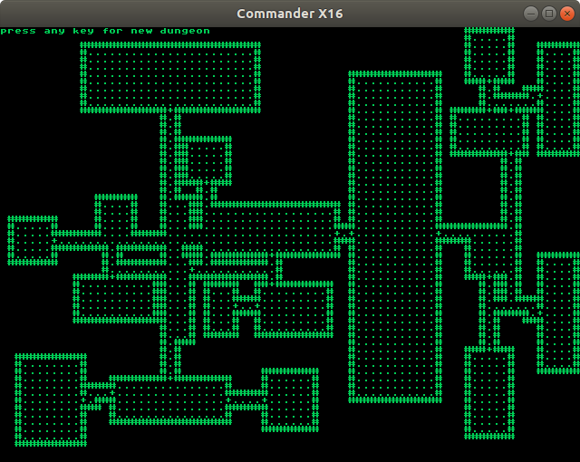

# nanohack

A little dungeon generator for cbm 8 bit machines and the cx16.

The original plan was to implement a small roguelike game for the cx16. But what with the recent licensing nonsense and the fact that I don't do facebook and youtube (which unfortunately are the main information sources for all things cx16) and the general lack of feedback for my previous cx16 programs, I kind of lost interest.

Maybe someone else finds it useful. I'd be delighted to see it in some cool new game somewhere.

